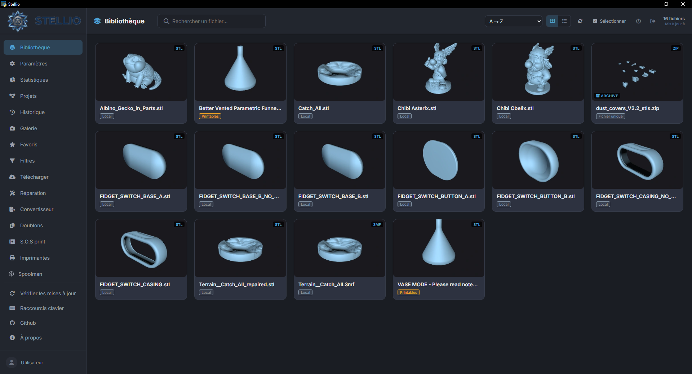
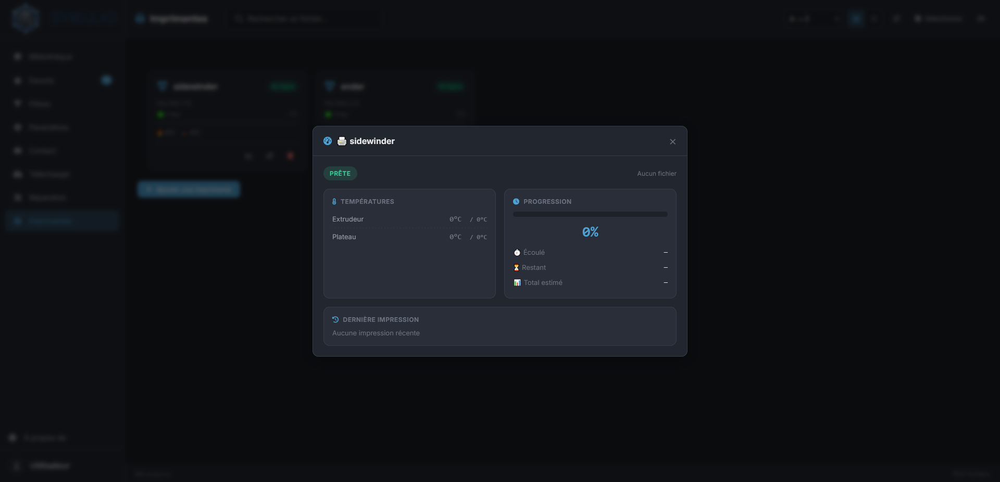
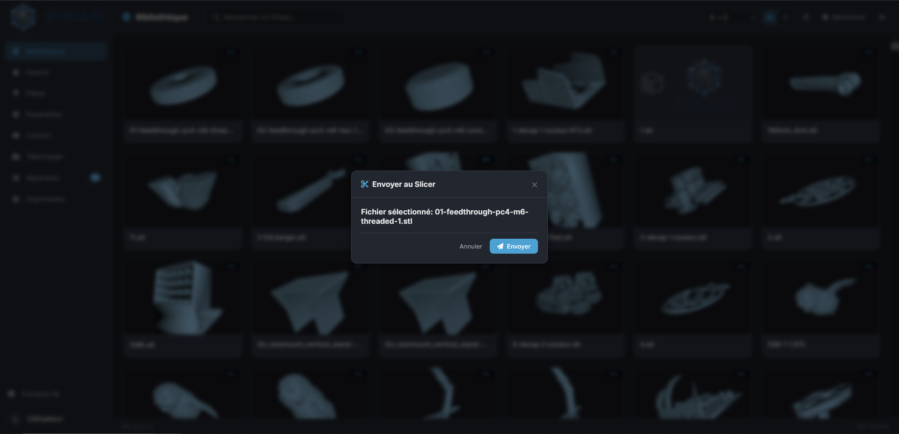
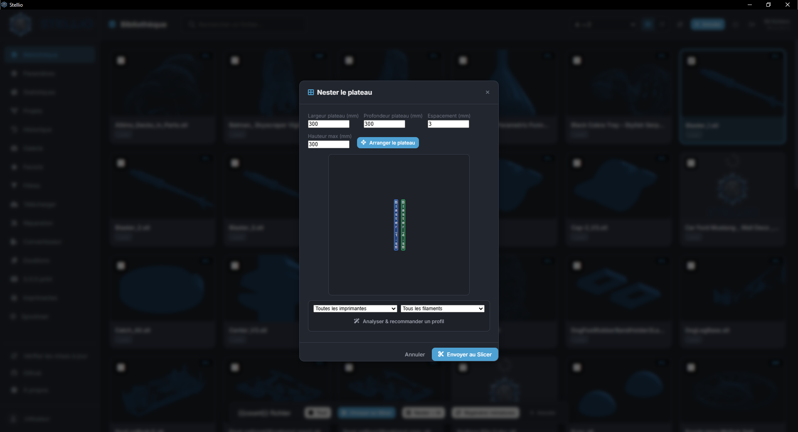

<div align="center">

#  

### Il gestore di file 3D definitivo per maker e proprietari di stampanti 3D

[](https://github.com/stellio-app/stellio-app/releases)
[](https://www.python.org/)
[](https://flask.palletsprojects.com/)
[](https://www.gnu.org/licenses/agpl-3.0)
[]()
[]()

[🇬🇧 English](README.md) | [🇫🇷 Français](README.fr.md) | [🇩🇪 Deutsch](README.de.md) | [🇪🇸 Español](README.es.md) | 🇮🇹 **Italiano** | [🇵🇹 Português](README.pt.md) | [🇯🇵 日本語](README.ja.md) | [🇨🇳 中文](README.zh.md)

[🚀 Installazione](#-installazione) • [✨ Funzionalità](#-funzionalità) • [📖 Documentazione](#-documentazione) • [🤝 Contribuire](#-contribuire) • [📜 Licenza](#-licenza)

</div>

---

## 🎯 Presentazione

**Stellio** è un'applicazione desktop moderna che centralizza tutta la tua libreria 3D (STL, 3MF, OBJ), automatizza le attività ripetitive e si integra perfettamente nel tuo flusso di lavoro di stampa 3D.

Che tu sia un maker alle prime armi o un utente esperto con più macchine, Stellio ti fa risparmiare tempo prezioso grazie all'**IA locale** (Ollama), alla **gestione intelligente delle stampanti** e a un'**interfaccia pensata per la produttività**.

> 💡 **Filosofia**: I tuoi dati restano da te. Tutto funziona in locale.

---

## ✨ Funzionalità

### 📚 Gestione della libreria
- 🗂️ **Sorgenti multiple**: cartelle locali, singoli file, condivisioni SMB/NFS
- 🖼️ **Miniature 3D automatiche** via PyRender (rendering di alta qualità) o Matplotlib (fallback)
- 🏷️ **Tag personalizzati** con colori + auto-tagging IA
- 🔍 **Ricerca semantica** assistita dall'IA ("cerco un supporto per...")
- ⭐ **Preferiti** e filtri avanzati (tipo, dimensione, peso, stato di stampa)
- 🧩 **Progetti/Assemblaggi**: raggruppa più file per lo stesso oggetto
- 📊 **Statistiche** dettagliate (formati, piattaforme, affidabilità dei profili)

### 🤖 Intelligenza Artificiale (Ollama locale)
- 🏷️ **Auto-tagging** intelligente dei file
- 📝 **Descrizione automatica** dei modelli
- 🔎 **Ricerca semantica** in linguaggio naturale
- 🎯 **Raccomandazione del profilo slicer** basata sulla geometria + storico dei successi
- 🩺 **S.O.S Print**: diagnosi dei fallimenti di stampa (con analisi foto)

### 🖨️ Gestione delle stampanti
- 🔌 Supporto per **OctoPrint**, **Klipper/Moonraker**, **Bambu Lab** (MQTT)
- 📡 Monitoraggio in tempo reale (temperature, avanzamento, telecamera)
- 🔧 **Manutenzione predittiva** con raccomandazioni per marca (Bambu, Prusa, Creality, ecc.)
- ⏱️ Contatore automatico delle ore di stampa
- 📤 Invio diretto allo slicer o caricamento sulla stampante

### 🧵 Gestione del filamento
- 🔗 Integrazione **Spoolman** (server di gestione delle bobine)
- 🟠 Supporto **AMS Bambu Lab** (lettura degli slot)
- 🟢 Supporto **CFS Creality**
- ⚪ Bobine manuali
- 📉 Conteggio automatico del consumo all'invio allo slicer
- ✅ Verifica di compatibilità (quantità sufficiente?)

### 📥 Download dalle piattaforme
- 🟠 **Printables** (API GraphQL)
- 🟢 **MakerWorld** (login Bambu Lab in 2 passaggi)
- 🔵 **Thingiverse** (tramite chiave API)
- 📁 Download diretto verso le tue sorgenti configurate

### 🧩 Strumenti avanzati
- 🎨 **Nesting automatico** del piano (rectpack o sagoma reale via shapely)
- 🔧 **Riparazione della mesh** (trimesh + pymeshfix)
- 🔄 **Convertitore di formati** (STL ↔ 3MF ↔ OBJ)
- 🛡️ **Verifica dell'integrità** (file corrotti/mancanti)
- 💰 **Calcolo del costo di stampa** (materiale + elettricità)
- 📸 **Galleria fotografica** di stampa (riuscite/fallite)
- 🕒 **Cronologia** con valutazione riuscita/fallita (alimenta l'IA)
- 🔍 **Rilevamento duplicati** (esatti e simili per geometria)

### 🌐 Accesso remoto e mobile
- 📱 **QR Code** per l'accesso mobile (PWA installabile)
- 🌍 **Accesso remoto** via Cloudflare Tunnel (gratuito, URL casuale o fisso)
- 🔗 **Link di condivisione** temporanei (24 ore, uso singolo)

### 🎨 Personalizzazione
- 🌓 Temi: Scuro / Chiaro / Sistema
- 🎨 Temi a marchio: Stellio, Bambu, Prusa, Voron, Creality
- 🎯 Colore d'accento personalizzato
- 🌍 **8 lingue**: FR, EN, DE, ES, IT, PT, JA, ZH
- 🧲 Riordino della navigazione con drag & drop

### 💾 Backup e aggiornamenti
- 📦 Esportazione/Importazione di backup completo (.zip)
- 🔄 Aggiornamenti automatici da GitHub (patch `.zip` — stesso meccanismo su Windows e Raspberry Pi/Linux)
- 📋 Esportazione dei log diagnostici (segreti oscurati)

---

## 🖼️ Screenshot

<div align="center">
<table>
<tr></tr>
<td><br><em>Libreria con miniature</em></td>
<td><br><em>Monitoraggio stampanti</em></td>
</tr>
<tr>
<td><br><em>Raccomandazione profilo IA</em></td>
<td><br><em>Nesting automatico</em></td>
</tr>
</table>
</div>

---

## 🚀 Installazione

### 🪟 Windows (consigliato)

1. Scarica l'ultimo installer dalle [Releases](https://github.com/stellio-app/stellio-app/releases)
2. Avvia `Stellio-Setup.exe`
3. Fatto! 🎉

### 🐧 Raspberry Pi / Linux

Funziona in **modalità server headless** (senza interfaccia grafica): Stellio gira in background e si usa da un browser, sia sul Pi stesso sia da qualsiasi dispositivo della rete locale.

**Requisiti**: consigliato Raspberry Pi 4 o 5, Raspberry Pi OS a **64 bit**.

```bash
curl -O https://raw.githubusercontent.com/stellio-app/stellio-app/main/install-pi.sh
chmod +x install-pi.sh
./install-pi.sh
```

Lo script installa automaticamente:
- le dipendenze di sistema (`ffmpeg`, `unrar-free`, librerie di rendering 3D)
- un ambiente virtuale Python dedicato
- un **servizio systemd** (`stellio.service`) che avvia Stellio all'avvio e lo riavvia automaticamente in caso di crash

Una volta installato, Stellio è raggiungibile su `http://<ip-del-pi>:5000`.

```bash
sudo systemctl status stellio     # Stato del servizio
sudo systemctl restart stellio    # Riavvio
sudo journalctl -u stellio -f     # Seguire i log in diretta
```

> 💡 **Stessi aggiornamenti di Windows**: la patch `.zip` pubblicata a ogni release è identica su entrambe le piattaforme (puro codice sorgente, nulla di compilato). Stellio la rileva e la applica da solo, poi riavvia il servizio — nessuna reinstallazione manuale necessaria.

> 🎥 Funzionalità identiche alla versione Windows, ad eccezione della finestra desktop nativa (sostituita dall'accesso via browser) e dell'IA locale Ollama, che richiede un modello ragionevolmente capace per funzionare bene su un Pi — punta `ollama_url` verso un server Ollama remoto nelle Impostazioni, se necessario.

### Slicer supportati

Stellio rileva automaticamente:
- ✅ OrcaSlicer
- ✅ Bambu Studio
- ✅ PrusaSlicer / SuperSlicer
- ✅ Ultimaker Cura
- ✅ Creality Print

### Stampanti

| Tipo | Protocollo | Funzionalità |
|------|-----------|-----------------|
| OctoPrint | API HTTP | Monitoraggio, upload, telecamera |
| Klipper/Moonraker | API HTTP | Monitoraggio, upload, telecamera, ore esatte |
| Bambu Lab | MQTT | Monitoraggio in tempo reale, AMS, telecamera (JPEG A1/P1, RTSPS X1/X2/H2) |

---

## 🛠️ Tecnologie

| Componente | Tecnologia |
|-----------|-------------|
| Backend | Python 3.8+, Flask, Waitress |
| Frontend | HTML5, CSS3, JavaScript vanilla |
| Database | SQLite (modalità WAL) |
| Desktop | pywebview (Windows) / modalità headless via browser (Raspberry Pi, Linux) |
| Rendering 3D | PyRender, Matplotlib, Three.js |
| Mesh | trimesh, pymeshfix, shapely |
| IA | Ollama (locale) |
| Rete | paho-mqtt, smbclient, requests |
| Crittografia | cryptography (AES-CFB) |
| Archivi | zipfile, rarfile, py7zr, tarfile |

---

## 📖 Documentazione

### Scorciatoie da tastiera

| Scorciatoia | Azione |
|-----------|--------|
| `Ctrl+F` | Cerca |
| `Ctrl+N` | Nuovo download |
| `Ctrl+,` | Impostazioni |
| `Alt+1-8` | Navigazione rapida |
| `F` | Attiva/disattiva preferiti |
| `T` | Gestione tag |
| `?` | Aiuto scorciatoie |
| `Esc` | Chiudi finestra modale / svuota ricerca |

### Struttura del progetto
```
stellio-app/
├── main.py                 # Backend Flask + Desktop
├── script.js                # JavaScript frontend
├── index.html                # Interfaccia principale
├── style.css                  # Stili
├── assets/                     # Loghi, icone
├── languages/                   # File di traduzione (JSON)
├── requirements-pi.txt           # Dipendenze Python (installazione Raspberry Pi / Linux)
├── install-pi.sh                  # Script di installazione Raspberry Pi / Linux (servizio systemd)
```

---

Hai un'idea? [Apri una issue](https://github.com/stellio-app/stellio-app/issues)!

---

## 🤝 Contribuire

I contributi sono benvenuti! 🎉

1. Fai un **fork** del progetto
2. Crea il tuo branch (`git checkout -b feature/AmazingFeature`)
3. Esegui il commit delle modifiche (`git commit -m 'Add AmazingFeature'`)
4. Fai il push del branch (`git push origin feature/AmazingFeature`)
5. Apri una **Pull Request**

### Linee guida
- Rispetta lo stile di codice esistente
- Aggiungi commenti in francese o inglese
- Testa le modifiche su Windows, se possibile
- Aggiorna la documentazione se necessario

### Segnalare un bug
Usa il template di bug report e includi:
- Versione di Stellio
- Sistema operativo
- Passaggi per riprodurlo
- Log degli errori (esportabili da Impostazioni → Diagnostica)

---

## 📜 Licenza

Questo progetto è distribuito con licenza libera **GNU Affero General Public License v3.0** — consulta il file [LICENSE](./LICENSE) per i dettagli.

> 💡 **In sintesi**: sei libero di copiare, modificare e distribuire questo software. Se modifichi Stellio o lo utilizzi per fornire un servizio ospitato in rete, devi pubblicare l'intero codice sorgente con la stessa licenza AGPLv3.

---

## 🙏 Ringraziamenti

- [Ollama](https://ollama.com/) per l'IA locale
- [Flask](https://flask.palletsprojects.com/) per il backend
- [Three.js](https://threejs.org/) per il rendering 3D web
- [trimesh](https://github.com/mikedh/trimesh) per l'elaborazione delle mesh
- La community maker per feedback e suggerimenti
- Tutti i contributori ❤️

---

## 📞 Contatti e supporto

- 🐛 **Segnalazione bug**: [GitHub Issues](https://github.com/stellio-app/stellio-app/issues)
- 💡 **Richiesta funzionalità**: [GitHub Discussions](https://github.com/stellio-app/stellio-app/discussions)
- 📧 **Email**: contact@stellio-app.com
- 🌐 **Sito web**: [stellio-app.com](https://stellio-app.com)

---

## ⭐ Sostieni il progetto

Se Stellio ti è utile, considera di:
- Mettere una **stella** ⭐ su GitHub
- Condividere il progetto intorno a te
- [Contribuire al codice](#-contribuire) o alla traduzione
- Segnalare bug per migliorare l'applicazione

---

<div align="center">

**Realizzato con ❤️ per la community maker**

[⭐ Star this repo](https://github.com/stellio-app/stellio-app) • [🐛 Report a bug](https://github.com/stellio-app/stellio-app/issues) • [💡 Request a feature](https://github.com/stellio-app/stellio-app/discussions)

</div>
